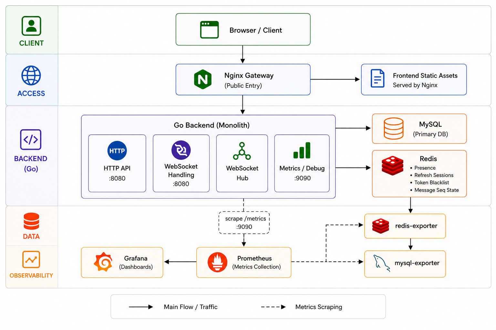
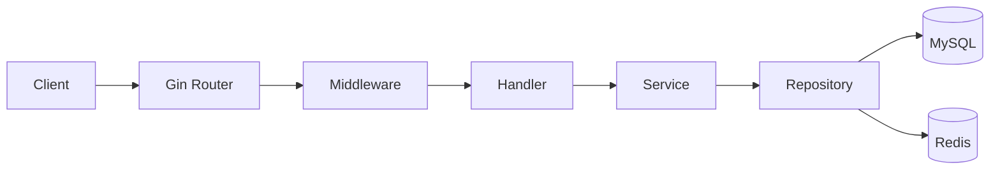

# IM System Architecture

## 1. 文档目的

本文档描述 `IM System` 的总体架构、组件职责、关键链路和当前部署边界。

## 2. 适用范围

本文档覆盖以下内容：

- 系统总体组件关系
- 后端单体的逻辑分层
- HTTP 与 WebSocket 的关键链路
- MySQL 与 Redis 的职责划分
- 当前架构边界与演进条件

本文档不覆盖：

- 具体协议字段定义
- 数据库字段明细
- 监控指标与告警规则细节

相关文档见：

- [database-design.md](./database-design.md)
- [websocket-flow.md](./websocket-flow.md)
- [performance-test.md](./performance-test.md)
- [monitoring.md](./monitoring.md)

## 3. 系统概览

下图展示了项目当前单机部署形态下的总体组件关系，包括入口层、后端单体、数据存储和监控链路。

系统由以下组件构成：

- `gateway`
  对外唯一入口，负责托管前端静态资源，并将 `/api`、`/api/v1/ws/`、头像资源转发到后端。
- `backend`
  Go + Gin 单体服务，承载 HTTP API、WebSocket 握手、业务逻辑和监控调试能力。
- `mysql`
  持久化用户、好友、会话、消息等核心业务数据。
- `redis`
  保存在线状态、刷新会话、消息序列状态等运行时数据。
- `prometheus`、`grafana`
  负责指标采集、展示和告警。

## 4. 逻辑分层

后端代码位于 `backend/internal/`，主要划分为以下层次：

- `handler`
  HTTP 和 WebSocket 入口层，负责参数解析、鉴权接入和响应转换。
- `service`
  业务规则层，负责会话、消息、群聊、好友、ACK、已读等核心逻辑。
- `repository`
  数据访问层，负责 MySQL 和 Redis 读写。
- `ws`
  WebSocket Hub、连接生命周期、实时投递和补偿逻辑。
- `middleware`
  鉴权、CORS、日志和恢复中间件。
- `monitoring`
  Prometheus 指标注册、HTTP 指标中间件、Hub 指标和调试端口。

该分层用于隔离协议处理、业务规则和存储访问。

## 5. 关键链路

### 5.1 HTTP 请求链路

HTTP 链路主要承载以下场景：

- 登录、刷新 token、登出
- 会话列表
- 历史消息
- 会话补洞同步
- 群聊管理

### 5.2 WebSocket 实时链路

```mermaid
flowchart LR
    client[Client]
    handshake["/api/v1/ws/ handshake"]
    register[Register Client to Hub]
    bootstrap[Bootstrap Offline Messages]
    ready[Enter Realtime State]
    events["message.send / delivered / read"]
    deliver[Hub Serial Delivery]
    peers[Target User Connections]

    client --> handshake
    handshake --> register
    register --> bootstrap
    bootstrap --> ready
    ready --> events
    events --> deliver
    deliver --> peers
```

WebSocket 链路承载以下职责：

- 实时消息收发
- 在线状态推送
- 已读回执推送

历史回放、范围补洞和会话摘要查询仍通过 HTTP 接口完成。

## 6. 数据职责划分

### 6.1 MySQL

MySQL 保存最终可信状态，包括：

- 用户信息
- 好友关系
- 好友申请
- 会话定义
- 会话成员状态与游标
- 消息记录

### 6.2 Redis

Redis 保存高频读写的运行时状态，包括：

- 在线状态 `presence`
- refresh session
- token blacklist
- 消息 `next_seq`
- `next_seq` 初始化锁

消息 `seq` 分配采用 Redis 自增与 MySQL 回源恢复结合的方式。Redis 负责高并发发号，MySQL 负责提供可恢复的持久化基线。

## 7. 部署边界

当前部署形态为单机部署，主要边界如下：

- WebSocket Hub 为单进程内存模型
- MySQL 与 Redis 当前按单实例部署
- 会话列表摘要聚合依赖数据库查询
- 头像资源保存在本地卷中

该边界与当前阶段的目标一致：优先保证链路正确性、部署简单性和维护成本可控。

## 8. 演进条件

当出现以下现象时，系统需要进入下一阶段演进：

- 会话列表 P95 延迟持续升高，且聚合查询明显占用数据库资源
- HTTP 流量增长到单实例 CPU 或连接池成为瓶颈
- Hub 连接数、队列压力或 `sync.required` 触发频率持续升高
- 静态资源需要在多实例间共享

对应演进方向包括：

- 引入会话摘要读优化模型
- 增加前置负载均衡并扩展无状态 HTTP 实例
- 将跨实例实时投递演进到 Redis Pub/Sub 或消息总线
- 将头像资源迁移到对象存储

## 9. 相关文档

- [database-design.md](./database-design.md)
- [websocket-flow.md](./websocket-flow.md)
- [performance-test.md](./performance-test.md)
- [monitoring.md](./monitoring.md)
- [backend/docs/ws-protocol.md](../backend/docs/ws-protocol.md)
