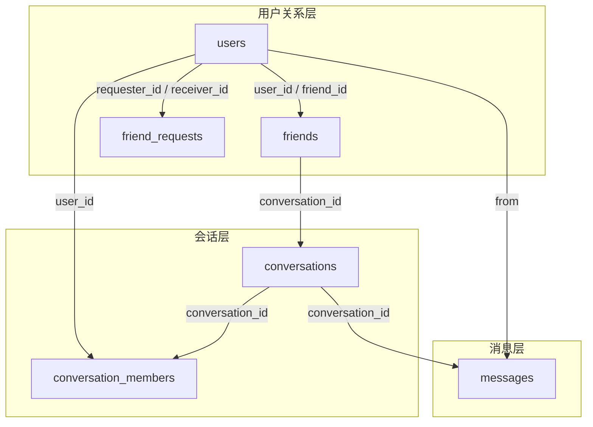

# Database Design

## 1. 文档目的

本文档描述 `IM System` 的核心数据模型、主要表结构、关键索引和消息游标设计。

## 2. 适用范围

本文档覆盖以下内容：

- 核心业务表
- 表之间的关系
- 单聊 / 群聊统一建模方式
- 消息 `seq` 分配与游标语义
- 幂等与事务边界

本文档不覆盖：

- 完整建表 SQL
- 每个 HTTP / WebSocket 接口的字段约束

## 3. 数据模型概览

当前核心业务表包括：

- `users`
- `friends`
- `friend_requests`
- `conversations`
- `conversation_members`
- `messages`

关系概览如下：

## 4. 核心表

### 4.1 `users`

用途：

- 保存用户基础资料和登录凭据。

关键字段：

| 字段 | 含义 |
| --- | --- |
| `id` | 用户主键 |
| `username` | 用户名，唯一 |
| `avatar` | 头像路径或资源引用 |
| `password` | bcrypt 哈希后的密码 |
| `created_at / updated_at` | 创建和更新时间 |

关键索引：

- `UNIQUE(username)`

### 4.2 `friends`

用途：

- 保存好友关系，并关联对应的单聊会话。

关键字段：

| 字段 | 含义 |
| --- | --- |
| `id` | 主键 |
| `user_id` | 当前用户 |
| `friend_id` | 好友用户 |
| `conversation_id` | 单聊会话 ID |
| `created_at` | 创建时间 |

关键索引：

- `UNIQUE(user_id, friend_id)`
- `INDEX(conversation_id)`

### 4.3 `friend_requests`

用途：

- 保存好友申请及其处理状态。

关键字段：

| 字段 | 含义 |
| --- | --- |
| `id` | 主键 |
| `requester_id` | 申请发起人 |
| `receiver_id` | 申请接收人 |
| `status` | `pending / accepted / rejected` |
| `message` | 申请附言 |
| `handled_at` | 处理时间 |
| `created_at / updated_at` | 创建和更新时间 |

关键索引：

- `INDEX(requester_id, status)`
- `INDEX(receiver_id, status)`
- `INDEX(requester_id, receiver_id, status)`

### 4.4 `conversations`

用途：

- 定义单聊和群聊会话实体。

关键字段：

| 字段 | 含义 |
| --- | --- |
| `id` | 会话主键 |
| `type` | `1=single`，`2=group` |
| `name` | 群名称 |
| `avatar` | 群头像 |
| `owner_id` | 群主 ID |
| `status` | `active / dismissed` |
| `single_key` | 单聊唯一键，格式 `min_id:max_id` |
| `created_at / updated_at` | 创建和更新时间 |

关键索引：

- `UNIQUE(type, single_key)`
- `INDEX(type)`
- `INDEX(status)`
- `INDEX(owner_id)`

### 4.5 `conversation_members`

用途：

- 保存用户在某个会话中的成员状态和游标状态。

关键字段：

| 字段 | 含义 |
| --- | --- |
| `id` | 主键 |
| `conversation_id` | 会话 ID |
| `user_id` | 成员用户 ID |
| `role` | 群角色 |
| `status` | `active / left / removed` |
| `visible` | 是否显示在当前用户会话列表中 |
| `invited_by` | 邀请人 ID |
| `joined_msg_seq` | 入会时的消息边界 |
| `last_acked_msg_seq` | 已确认收到的最大 `seq` |
| `last_read_msg_seq` | 已读的最大 `seq` |
| `last_sent_msg_seq` | 当前成员自己发出的最新消息 `seq` |
| `created_at / updated_at` | 创建和更新时间 |

关键索引：

- `UNIQUE(conversation_id, user_id)`
- `INDEX(user_id, visible, conversation_id)`
- `INDEX(conversation_id, status)`
- `INDEX(conversation_id, status, last_sent_msg_seq)`

### 4.6 `messages`

用途：

- 保存普通文本消息和系统事件消息。

关键字段：

| 字段 | 含义 |
| --- | --- |
| `id` | 主键 |
| `msg_id` | 客户端生成的幂等键 |
| `conversation_id` | 所属会话 |
| `seq` | 会话内单调递增序号 |
| `type` | `text / system` |
| `event` | 系统消息事件类型 |
| `from` | 发送者用户 ID |
| `send_time` | 毫秒时间戳 |
| `content` | 消息正文 |
| `extra` | 系统消息附加结构化数据 |
| `created_at` | 创建时间 |

关键索引：

- `UNIQUE(msg_id)`
- `UNIQUE(conversation_id, seq)`
- `INDEX(conversation_id, send_time, seq)`
- `INDEX(conversation_id, from, send_time)`

## 5. 关键设计

### 5.1 单聊 / 群聊统一建模

`conversations` 同时承载单聊和群聊，通过 `type` 区分会话类型，通过 `single_key` 约束单聊唯一性。

### 5.2 会话成员游标

`conversation_members` 保存以下用户视角状态：

- 可见性 `visible`
- 入会边界 `joined_msg_seq`
- 送达游标 `last_acked_msg_seq`
- 已读游标 `last_read_msg_seq`
- 发送者最新消息游标 `last_sent_msg_seq`

该设计用于支持：

- 会话列表显示控制
- 离线补推边界
- 未读数统计
- ACK / 已读推进

### 5.3 消息游标

消息链路的统一业务游标为会话内 `seq`。`msg_id` 与 `seq` 的职责划分如下：

- `msg_id`
  发送端幂等键。
- `seq`
  会话内顺序、补洞、ACK、已读和历史范围读取的统一游标。

## 6. `seq` 分配

`seq` 分配采用 Redis 状态与 MySQL 回源恢复结合的方式：

1. Redis 保存会话维度的 `next_seq`
2. 发消息时通过 Redis 自增获取下一个 `seq`
3. 如果 Redis 中不存在 `next_seq`，先回源 MySQL 读取该会话 `MAX(seq)` 初始化
4. 初始化期间通过 Redis 锁防止并发重复初始化

该流程用于兼顾：

- 会话内单调递增顺序
- 运行时发号性能
- Redis 状态可恢复性

## 7. 幂等与事务

### 7.1 幂等

消息写入以 `msg_id` 为幂等键：

- 首次写入成功则正常落库
- 重复提交时返回已有消息记录

### 7.2 事务边界

消息发送事务至少包括以下操作：

- 校验会话状态
- 校验发送者成员状态
- 单聊场景校验好友关系
- 写入 `messages`
- 恢复成员可见性
- 推进发送者自己的消息游标

## 8. 约束与边界

当前数据模型的边界如下：

- ACK 和已读按“用户对会话”建模，不拆分为逐消息回执表
- 会话摘要未单独维护物化读模型
- 单聊和群聊共享同一套会话主表
- Redis 保存运行时状态，MySQL 保存最终可信状态

## 9. 相关文档

- [architecture.md](./architecture.md)
- [websocket-flow.md](./websocket-flow.md)
- [backend/docs/error-codes.md](../backend/docs/error-codes.md)
