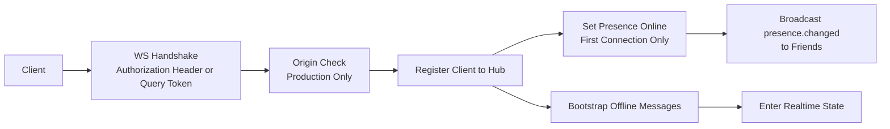
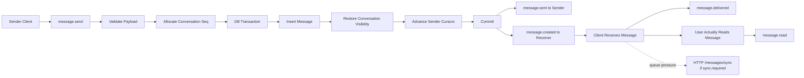

# WebSocket Flow

## 1. 文档目的

本文档描述 `/api/v1/ws/` 实时链路的服务端处理流程，包括连接建立、离线补推、实时消息收发、ACK / 已读推进以及补洞触发条件。

协议字段定义见：

- [backend/docs/ws-protocol.md](../backend/docs/ws-protocol.md)

## 2. 适用范围

本文档覆盖以下内容：

- WebSocket 握手与连接注册
- 连接 bootstrap 与离线消息补推
- `message.send`、`message.delivered`、`message.read` 的服务端处理流程
- `sync.required` 的触发条件与客户端补洞要求

本文档不覆盖：

- HTTP 接口字段定义
- 错误码全集
- 群聊业务规则明细

## 3. 流程概览

连接建立后的处理顺序为：

1. 握手认证
2. Origin 校验
3. 连接注册到 Hub
4. 首条连接触发在线状态更新
5. 执行 bootstrap
6. 连接切换为实时态

## 4. 连接建立

### 4.1 认证方式

客户端连接 `/api/v1/ws/` 时支持以下认证方式：

- `Authorization: Bearer <token>`
- `?token=<jwt>`

生产环境要求 `Origin` 位于允许列表中。

### 4.2 连接注册

握手成功后，连接被包装为 `Client` 并注册到 Hub。Hub 内部按用户维度维护连接集合：

- `user_id -> connection_id -> clientConnection`

该结构支持同一用户的多端或多标签页并存。

### 4.3 在线状态更新

当某个用户的首条连接注册成功后，服务端执行以下动作：

- 将在线状态写入 Redis
- 向好友广播 `presence.changed`

同一用户的后续连接不会重复触发上线广播。

## 5. Bootstrap 与离线补推

连接注册成功后，Hub 不会立即将连接标记为 ready，而是先执行 bootstrap。

bootstrap 流程如下：

1. 根据会话成员游标读取离线消息
2. 将离线消息统一封装为 `message.created`
3. 将结果投递到当前连接
4. bootstrap 成功后切换到实时态

该顺序用于保证：

- 离线补推与实时消息使用同一业务游标
- 连接切换期间不引入消息乱序
- 客户端统一处理 `message.created` 下行事件

## 6. 实时消息流程

### 6.1 发送流程

`message.send` 的服务端处理顺序如下：

1. 校验 `msg_id`、`conversation_id`、`content`
2. 为目标会话分配下一个 `seq`
3. 进入消息事务
4. 校验会话状态、发送者成员状态和单聊好友关系
5. 写入 `messages`
6. 恢复相关成员的会话可见性
7. 推进发送者自己的 `last_sent_msg_seq`、`last_acked_msg_seq`、`last_read_msg_seq`
8. 事务提交成功后组装实时投递任务

### 6.2 下行事件

消息成功落库后，服务端下发两类事件：

- 发送者收到 `message.sent`
- 其他在线成员收到 `message.created`

该拆分用于区分：

- 发送方落库确认
- 接收方新消息通知

## 7. ACK 与已读

### 7.1 Delivered

客户端收到消息后，上行 `message.delivered`，用于推进：

- `conversation_members.last_acked_msg_seq`

该事件仅作为上行 ACK 使用，服务端不广播 `message.delivered`。

### 7.2 Read

客户端确认用户实际读到消息后，上行 `message.read`，用于推进：

- `conversation_members.last_read_msg_seq`

推进成功后，服务端向会话在线成员广播 `message.read`。

ACK 与已读是两类独立状态：

- ACK 表示连接已接收
- Read 表示用户已实际阅读

## 8. 补洞规则

离线补推和同步补洞均以会话内 `seq` 作为统一业务游标。

离线补推边界如下：

- 每个会话从 `max(joined_msg_seq, last_acked_msg_seq)` 之后开始
- 只读取 MySQL 已提交消息
- 多会话结果按 `send_time ASC`、`conversation_id ASC`、`seq ASC` 合并

该规则保证：

- 新入群成员不会读取入群前消息
- 已 ACK 的消息不会在重连后重复补推

当客户端需要主动补洞时，使用：

- `GET /api/v1/messages/sync?conversation_id=...&after_seq=...`

## 9. `sync.required`

当实时链路无法继续保证局部消息投递完整性时，服务端下发 `sync.required`。

典型触发条件包括：

- Hub forward queue 满
- 连接 ready 前的 pending queue 满
- 连接 send queue 满
- bootstrap 或转发过程出现拥塞

客户端收到该事件后应执行：

1. 记录受影响的 `conversation_id`
2. 调用 `/api/v1/messages/sync`
3. 使用补洞结果修正本地游标
4. 继续接收后续实时消息

该机制用于将实时链路过载恢复到 HTTP 可查询真相。

## 10. 设计约束

当前实时链路的设计约束如下：

- 以会话内 `seq` 作为唯一业务游标
- WebSocket 负责实时投递，不承载全部真相查询
- 最终一致性依赖 MySQL 已提交消息与 HTTP 补洞接口
- Hub 采用单进程串行主循环

该设计优先保证：

- 顺序一致性
- 断线恢复能力
- 多连接并存能力
- 过载时的降级路径

当前不覆盖：

- 分布式 Hub
- 跨实例在线路由
- 大规模广播优化

## 11. 相关文档

- [backend/docs/ws-protocol.md](../backend/docs/ws-protocol.md)
- [database-design.md](./database-design.md)
- [architecture.md](./architecture.md)
